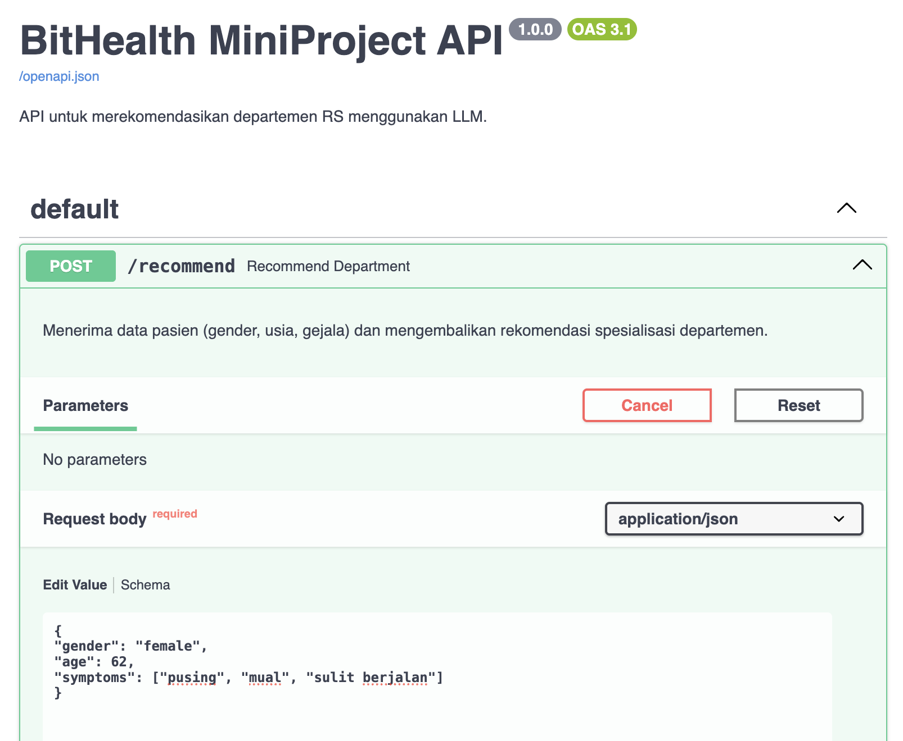
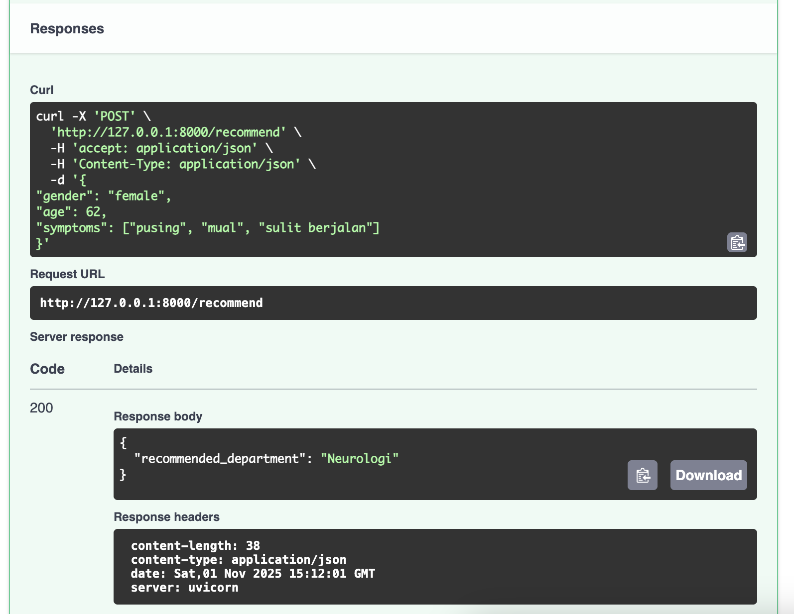
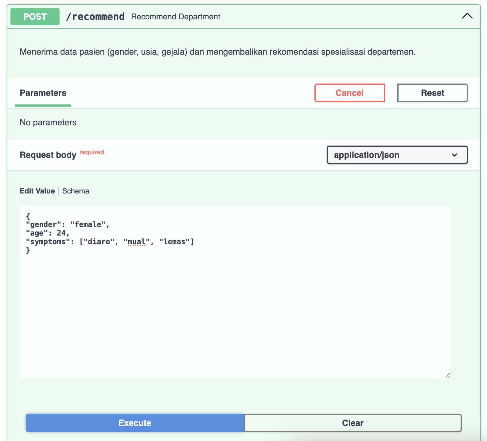
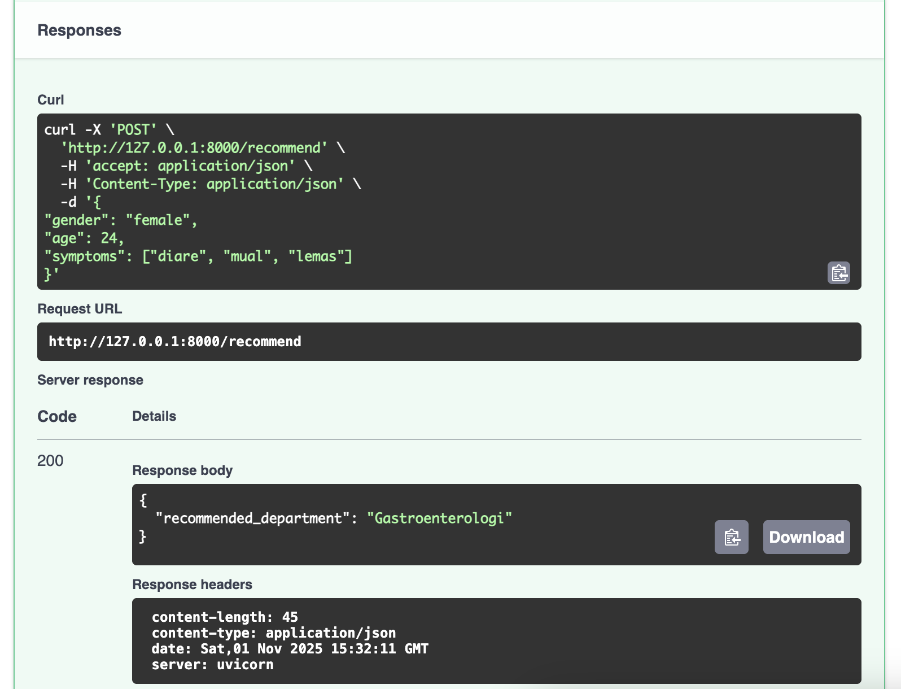

# BitHealth_MiniProject: API Triase RS dengan LLM

Ini adalah layanan API sederhana yang dibuat dengan FastAPI. Proyek ini menggunakan Large Language Model (LLM) dari Google Gemini Pro untuk merekomendasikan departemen rumah sakit yang relevan berdasarkan gejala, usia, dan gender pasien.

## 🚀 Teknologi yang Digunakan

* **FastAPI**: Untuk membangun server API.
* **Google AI Studio (Gemini)**: Sebagai model LLM (via `gemini-2.5-pro`) untuk rekomendasi.
* **LangChain**: Sebagai *framework* untuk menghubungkan API ke LLM dan mengelola *prompt*.
* **Pydantic**: Untuk validasi data input dan output.
* **Uvicorn**: Sebagai server ASGI untuk menjalankan FastAPI.

## 📋 Cara Menjalankan Aplikasi

### 1. Prasyarat

* Python 3.13.7
* Akun Google dan API Key dari [Google AI Studio](https://aistudio.google.com/).

### 2. Setup Lokal

1.  **Clone repositori:**
    ```bash
    git clone [https://github.com/aulianisa21/BitHealth_MiniProject.git](https://github.com/aulianisa21/BitHealth_MiniProject.git)
    cd BitHealth_MiniProject
    ```

2.  **Membuat dan mengaktifkan *Virtual Environment***:
    ```bash
    # Buat venv (Mac/Linux)
    python3 -m venv venv

    # Aktifkan venv (Mac/Linux)
    source venv/bin/activate
    ```

3.  **Install semua dependensi:**
    ```bash
    pip install fastapi "uvicorn[standard]" langchain langchain-google-genai python-dotenv
    ```

4.  **Buat file `.env`:**
    * Buat file bernama `.env` di dalam folder proyek.
    * Tambahkan API Key Anda ke dalamnya:
    ```
    GOOGLE_API_KEY=KEY_API
    ```

### 3. Menjalankan Server

1.  Jalankan server Uvicorn dari terminal (pastikan `(venv)` aktif):
    ```bash
    uvicorn main:app --reload
    ```
2.  Server akan berjalan di `http://127.0.0.1:8000`.

## 4. Cara Menguji API

1.  Buka browser dan akses dokumentasi API di: `http://127.0.0.1:8000/docs`

2.  Temukan endpoint `POST /recommend` dan klik "Try it out".

3.  Masukkan data pasien dalam format JSON.

    **Contoh 1: Input Sesuai Task** (Input untuk `1.execute.png`)
    

4.  Tekan "Execute". Anda akan mendapatkan respons yang sesuai.

    **Hasil Contoh 1: "Neurologi"** (Hasil dari `2.result.png`)
    

5.  Saya coba memasukkan data lain, dengan mengganti umur dan gejala.

    **Contoh 2: Input Berbeda** (Input dari `3.example.png`)
    

6.  AI akan memberikan respons yang dinamis berdasarkan input baru tersebut.

    **Hasil Contoh 2: "Gastroenterologi"** (Hasil dari `4.example_result.png`)
    